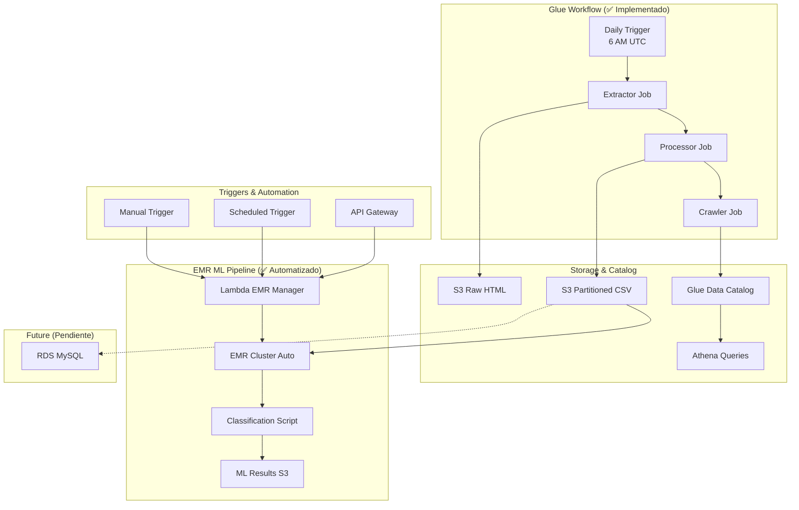

# Parcial Final - Big Data Pipeline

Este proyecto implementa un pipeline completo de procesamiento de datos de noticias utilizando servicios de AWS, incluyendo extracción web, procesamiento, almacenamiento y análisis con machine learning.

## Descripción del Proyecto

Pipeline de datos que extrae, procesa y analiza noticias de periódicos colombianos utilizando arquitectura serverless y servicios de AWS.

## Progreso del Proyecto

### ✅ Completados

#### a) Lambda de Extracción Web con Zappa ✅

Crear un lambda usando **Zappa** que descargue cada día la página principal de:

- El Tiempo
- El Espectador (o Publímetro)

**Estructura de almacenamiento en S3:**

```
s3://bucket/headlines/raw/contenido-yyyy-mm-dd.html
```

#### b) Lambda de Procesamiento con BeautifulSoup ✅

Una vez llega el archivo a la carpeta `raw`, se debe activar un segundo lambda que procese los datos utilizando **BeautifulSoup**.

**Extracción de datos:**

- Categoría
- Titular
- Enlace

**Estructura de salida CSV:**

```
s3://bucket/headlines/final/periodico=xxx/year=xxx/month=xxx/day=xxx
```

#### c) Lambda de Actualización de Catálogo ✅

Crear un tercer lambda que ejecute un **crawler en Glue** (usando boto3) para:

- Actualizar las particiones en el catálogo de Glue
- Permitir visualización de datos por **AWS Athena**

#### d) Migración a Glue Jobs y Workflows ✅

Repetir los puntos **a)** al **c)** implementados como:

- **Jobs de Python en Glue** ✅
- Articulados en un **workflow** como el del parcial 2 ✅

**📂 Implementación disponible en:** `glue_jobs/`

**Características implementadas:**
- 3 Glue Jobs (extractor, processor, crawler)
- Workflow completo con triggers condicionales
- Script de deployment automatizado
- Suite de testing comprehensiva
- Documentación detallada

#### f) Pipeline de Machine Learning con PySpark ✅

Crear un pipeline de procesamiento usando **PySpark ML** en **Notebook sobre EMR**:

**Características implementadas:**

- ✅ Vectorización con **TF-IDF**
- ✅ Modelo de clasificación **Logistic Regression**
- ✅ Script ejecutable para EMR con **spark-submit**
- ✅ Resultados escritos en **S3** (múltiples formatos)
- ✅ Manejo robusto de errores y logging
- ✅ Evaluación train/test del modelo

**📂 Implementación disponible en:** `emr_scripts/`

#### g) Automatización EMR con Lambda ✅

**Implementación completa:**

- ✅ Convertir notebook anterior en **script ejecutable**
- ✅ Crear lambda que:
  - Lance un cluster EMR automáticamente
  - Ejecute el script con `spark-submit`
  - Monitoree la ejecución completa
  - Apague el cluster automáticamente (ahorro de costos)

**📂 Implementación disponible en:** `lambdas/emr_manager/`

**Características del Lambda:**
- Configuración automática de cluster EMR
- Upload dinámico del script a S3
- Monitoreo en tiempo real de la ejecución
- Cleanup automático de recursos
- Manejo robusto de errores y timeouts
- Soporte para configuración personalizada

### 🚧 Pendientes

#### e) Integración con RDS MySQL

**Base de datos:**

- Crear BD **MySQL en RDS** con la tabla respectiva
- Mapear con un crawler al catálogo de Glue

**Job de inserción:**

- Usar **AWS Glue Connectors** y **AWS Job**
- Copiar de tabla a tabla (S3 → RDS en el catálogo)
- **Activar "job bookmarks"** para evitar duplicados

## Requisitos de Entrega

### 📋 Obligatorios

- **Código en GitHub** con:
  - ✅ Uso de ramas
  - ✅ Commits descriptivos
  - ✅ Código limpio y comentado
  - ✅ Pruebas unitarias (donde aplique)

> **⚠️ Penalización:** Menos una unidad si no se cumple

### 🚀 Puntos Adicionales

- **Pipeline de despliegue continuo** en GitHub para scripts de jobs
- **Puntos a-d obligatorios** implementados por código con:
  - Pruebas unitarias
  - Despliegue continuo en GitHub

## Tecnologías Utilizadas

- **AWS Lambda** - Funciones serverless
- **Zappa** - Framework para deployment de Lambda
- **AWS S3** - Almacenamiento de objetos
- **AWS Glue** - ETL y catálogo de datos
- **AWS Athena** - Consultas SQL sobre S3
- **AWS RDS MySQL** - Base de datos relacional
- **AWS EMR** - Cluster de Spark
- **BeautifulSoup** - Web scraping
- **PySpark ML** - Machine Learning distribuido
- **GitHub Actions** - CI/CD

## Estructura del Proyecto

```
├── lambdas/
│   ├── extractor/               # Lambda de extracción web
│   ├── processor/               # Lambda de procesamiento HTML
│   ├── crawler/                # Lambda de crawler Glue
│   └── emr_manager/            # ✅ Lambda de gestión EMR
│       ├── lambda_function.py  # Lógica principal del Lambda
│       ├── requirements.txt    # Dependencias AWS
│       ├── zappa_settings.json # Configuración deployment
│       └── README.md          # Documentación completa
├── glue_jobs/                  # ✅ Jobs y Workflows de Glue
│   ├── extractor_job.py        # Job de extracción migrado
│   ├── processor_job.py        # Job de procesamiento migrado
│   ├── crawler_job.py          # Job de crawler migrado
│   ├── workflow_definition.py  # Definición del workflow
│   ├── deploy.py               # Script de deployment
│   ├── test_jobs.py           # Suite de testing
│   ├── requirements.txt        # Dependencias
│   └── README.md              # Documentación detallada
├── emr_scripts/               # ✅ Scripts para EMR
│   ├── classification_pipeline.py  # Script de ML ejecutable
│   ├── requirements.txt        # Dependencias de EMR
│   └── README.md              # Documentación de EMR
├── notebook/                  # 📓 Notebooks de desarrollo
│   └── classification.ipynb   # Notebook original de ML
├── tests/                     # Pruebas unitarias
├── .github/workflows/         # CI/CD pipelines
└── README.md                  # Esta documentación
```

## 🚀 Quick Start - Glue Jobs (Punto d)

### 1. Configurar credenciales AWS
```bash
aws configure
```

### 2. Desplegar Glue Jobs y Workflow
```bash
cd glue_jobs/
python deploy.py YOUR_BUCKET_NAME YOUR_IAM_ROLE_ARN us-east-1
```

### 3. Probar el workflow
```bash
python test_jobs.py all YOUR_BUCKET_NAME
```

### 4. Verificar en AWS Console
- **AWS Glue > Workflows**: Verificar `news-processing-workflow`
- **AWS Athena**: Consultar datos en `news_headlines_db`
- **S3**: Verificar estructura de particiones

Para más detalles, consultar: [`glue_jobs/README.md`](glue_jobs/README.md)

## 🚀 Quick Start - EMR ML Pipeline (Punto f)

### 1. Subir script a S3
```bash
aws s3 cp emr_scripts/classification_pipeline.py s3://your-bucket/scripts/
```

### 2. Ejecutar en cluster EMR
```bash
spark-submit \
    --deploy-mode cluster \
    --driver-memory 4g \
    --executor-memory 4g \
    s3://your-bucket/scripts/classification_pipeline.py \
    --input-path "s3://final-gizmo/headlines/final/periodico=*/year=*/month=*/day=*/*.csv" \
    --output-path "s3://final-gizmo/resultados/"
```

Para más detalles, consultar: [`emr_scripts/README.md`](emr_scripts/README.md)

## 🚀 Quick Start - EMR Lambda Manager (Punto g)

### 1. Desplegar Lambda con Zappa
```bash
cd lambdas/emr_manager/
pip install -r requirements.txt
pip install zappa
zappa deploy dev
```

### 2. Ejecutar pipeline completo
```bash
# Ejecución básica
aws lambda invoke \
    --function-name emr-manager-dev \
    --payload '{}' \
    response.json

# Con configuración personalizada
aws lambda invoke \
    --function-name emr-manager-dev \
    --payload '{"core_instance_count": 3, "timeout_minutes": 90}' \
    response.json
```

### 3. Programar ejecución diaria
```bash
aws events put-rule \
    --name "daily-ml-pipeline" \
    --schedule-expression "cron(0 2 * * ? *)"
```

Para más detalles, consultar: [`lambdas/emr_manager/README.md`](lambdas/emr_manager/README.md)

## 📈 Roadmap

- [x] **Punto a)** - Lambda Extractor con Zappa
- [x] **Punto b)** - Lambda Processor con BeautifulSoup  
- [x] **Punto c)** - Lambda Crawler para Glue
- [x] **Punto d)** - Migración a Glue Jobs y Workflows
- [ ] **Punto e)** - Integración con RDS MySQL
- [x] **Punto f)** - Pipeline de ML con PySpark (Script ✅)
- [x] **Punto g)** - Automatización EMR con Lambda (✅ COMPLETADO)
- [ ] **CI/CD** - Pipeline de despliegue continuo
- [ ] **Testing** - Cobertura completa de pruebas

## 📊 Arquitectura Actual



## 🔗 Enlaces Útiles

- [Documentación AWS Glue](https://docs.aws.amazon.com/glue/)
- [Documentación AWS EMR](https://docs.aws.amazon.com/emr/)
- [Documentación AWS Lambda](https://docs.aws.amazon.com/lambda/)
- [Documentación Zappa](https://github.com/zappa/Zappa)
- [AWS CLI Setup](https://docs.aws.amazon.com/cli/latest/userguide/getting-started-install.html)
- [BeautifulSoup Documentation](https://www.crummy.com/software/BeautifulSoup/bs4/doc/)
- [PySpark ML Guide](https://spark.apache.org/docs/latest/ml-guide.html)
