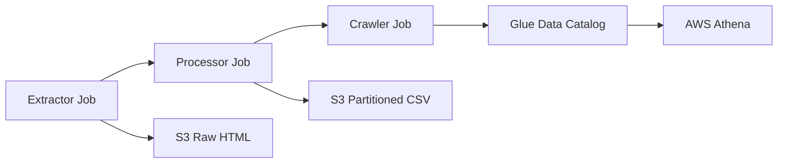

# Punto d) Migración a Glue Jobs y Workflows

Esta implementación migra los puntos **a)**, **b)** y **c)** de Lambdas a **AWS Glue Jobs** articulados en un **workflow**.

## 📋 Contenido

### Jobs Implementados

1. **`extractor_job.py`** - Migración del punto a)

   - Extracción web de El Tiempo y El Espectador
   - Almacenamiento en S3 como HTML crudo
   - Reemplaza la funcionalidad del Lambda extractor

2. **`processor_job.py`** - Migración del punto b)

   - Procesamiento HTML con BeautifulSoup
   - Extracción de datos estructurados (categoría, titular, enlace)
   - Almacenamiento particionado en S3 como CSV
   - Reemplaza la funcionalidad del Lambda processor

3. **`crawler_job.py`** - Migración del punto c)
   - Ejecución de crawler Glue usando boto3
   - Actualización de particiones en catálogo
   - Habilitación de consultas en AWS Athena
   - Reemplaza la funcionalidad del Lambda crawler

## 🔄 Flujo de Trabajo



## 📊 Esquema de Datos

### Entrada (HTML crudo)

```
s3://bucket/headlines/raw/contenido-yyyy-mm-dd.html
```

### Salida (CSV estructurado)

```
s3://bucket/headlines/final/periodico=xxx/year=xxx/month=xxx/day=xxx/
```

**Campos extraídos:**

- `fecha`: Fecha de la noticia
- `categoria`: Categoría/sección del artículo
- `titular`: Título de la noticia
- `enlace`: URL completa del artículo
- `periodico`: Nombre del periódico (eltiempo/elespectador)

## 🚀 Deployment

Estos jobs se despliegan automáticamente como parte del workflow principal:

```bash
cd glue_jobs/
python deploy.py YOUR_BUCKET_NAME YOUR_IAM_ROLE_ARN us-east-1
```

## ⚙️ Configuración de Jobs

### Recursos

- **Worker Type**: G.1X (4 vCPU, 16 GB RAM)
- **Number of Workers**: 2
- **Timeout**: 60 minutos
- **Glue Version**: 3.0

### Parámetros

- `--S3_BUCKET`: Bucket de S3 para almacenamiento
- `--S3_PREFIX`: Prefijo para archivos de entrada
- `--S3_OUTPUT_PREFIX`: Prefijo para archivos de salida
- `--DATABASE_NAME`: Base de datos en Glue Catalog
- `--CRAWLER_NAME`: Nombre del crawler
- `--IAM_ROLE_ARN`: Rol IAM para el crawler

## 📈 Ventajas sobre Lambdas

### Escalabilidad

- ✅ Procesamiento distribuido con Spark
- ✅ Manejo de volúmenes grandes de datos
- ✅ Auto-scaling automático de workers

### Durabilidad

- ✅ Timeout extendido (15 min → 60 min)
- ✅ Reintentos automáticos
- ✅ Job bookmarks para continuidad

### Monitoreo

- ✅ CloudWatch métricas detalladas
- ✅ Logs estructurados
- ✅ Integración con workflow de Glue

### Costo

- ✅ Pago por uso (sin tiempo idle)
- ✅ Mejor para procesamiento batch
- ✅ Optimización automática de recursos

## 🧪 Testing Individual

Para probar jobs individualmente:

```bash
# Extractor
aws glue start-job-run --job-name news-extractor-job

# Processor
aws glue start-job-run --job-name news-processor-job

# Crawler
aws glue start-job-run --job-name news-crawler-job
```

## 📋 Criterios de Migración Exitosa

- [x] **Funcionalidad equivalente** - Misma extracción y procesamiento
- [x] **Mejores recursos** - Procesamiento distribuido
- [x] **Workflow automático** - Ejecución secuencial
- [x] **Triggers condicionales** - Basados en éxito/fallo
- [x] **Monitoreo mejorado** - CloudWatch integrado
- [x] **Escalabilidad** - Manejo de datos grandes

## 🔗 Referencias

- [AWS Glue Jobs](https://docs.aws.amazon.com/glue/latest/dg/author-job.html)
- [AWS Glue Workflows](https://docs.aws.amazon.com/glue/latest/dg/workflows_overview.html)
- [Migración Lambda a Glue](https://docs.aws.amazon.com/glue/latest/dg/aws-glue-programming-python.html)
