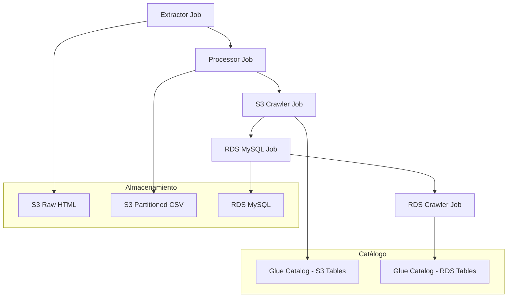

# AWS Glue RDS Integration - Punto e) del Proyecto

Esta implementación añade integración con RDS MySQL al pipeline de noticias existente, cumpliendo con el **punto e)** del parcial final.

## 📋 Componentes Implementados

### 1. `rds_mysql_job.py` - Job de Copia S3 → RDS

- **Función**: Copia datos procesados desde S3 (vía Glue Data Catalog) a RDS MySQL
- **Fuente**: Tabla `news_headlines` en base de datos `news_headlines_db` (Glue Catalog)
- **Destino**: Tabla `noticias` en base de datos `news` (RDS MySQL)
- **Features**:
  - ✅ Job bookmarks activados (evita duplicados)
  - ✅ Transformación de datos para compatibilidad MySQL
  - ✅ Conexión JDBC automática
  - ✅ Estadísticas de procesamiento
  - ✅ Manejo de errores robusto

### 2. `rds_crawler_job.py` - Crawler para RDS

- **Función**: Mapea tablas RDS MySQL al catálogo de Glue
- **Destino**: Base de datos `news_rds_db` en Glue Data Catalog
- **Features**:
  - ✅ Creación automática de conexión JDBC
  - ✅ Configuración automática del crawler
  - ✅ Verificación de tablas creadas
  - ✅ Monitoreo de progreso

## 🚀 Setup y Configuración

### Paso 1: Configurar RDS MySQL

1. **Crear instancia RDS MySQL** (si no existe):

   ```bash
   # Tu instancia ya existe: news2
   # Base de datos: news
   # Usuario: admin
   # Contraseña: 123456789
   ```

2. **Ejecutar script SQL**:
   ```bash
   mysql -h news2.cluster-xxxxx.us-east-1.rds.amazonaws.com -u admin -p news < setup_mysql_table.sql
   ```

### Paso 2: Configurar Credenciales y Endpoint

**IMPORTANTE**: Actualizar el endpoint RDS real en `workflow_definition.py`:

```python
# Reemplazar esta línea:
'--RDS_ENDPOINT': 'news2.cluster-xxxxx.us-east-1.rds.amazonaws.com',

# Con el endpoint real de tu instancia:
'--RDS_ENDPOINT': 'news2.cluster-real-endpoint.us-east-1.rds.amazonaws.com',
```

### Paso 3: Configurar Security Groups

Asegúrate de que:

- El security group de RDS permita conexiones desde Glue (puerto 3306)
- El security group de Glue tenga acceso de salida al RDS

### Paso 4: Desplegar los Jobs

```bash
cd glue_jobs/
python deploy.py YOUR_BUCKET_NAME YOUR_IAM_ROLE_ARN us-east-1
```

## 🔄 Flujo de Trabajo Completo



## 📊 Esquema de Datos

### Tabla RDS: `noticias`

```sql
CREATE TABLE noticias (
    id INT AUTO_INCREMENT PRIMARY KEY,
    fecha DATE NOT NULL,
    categoria VARCHAR(255),
    titular TEXT NOT NULL,
    enlace TEXT,
    periodico VARCHAR(100),
    created_at TIMESTAMP DEFAULT CURRENT_TIMESTAMP,
    updated_at TIMESTAMP DEFAULT CURRENT_TIMESTAMP ON UPDATE CURRENT_TIMESTAMP,
    UNIQUE KEY unique_news (fecha, titular(500), periodico)
);
```

### Mapeo de Campos

| S3/Glue   | RDS MySQL  | Tipo         | Descripción          |
| --------- | ---------- | ------------ | -------------------- |
| fecha     | fecha      | DATE         | Fecha de la noticia  |
| categoria | categoria  | VARCHAR(255) | Categoría/sección    |
| titular   | titular    | TEXT         | Título de la noticia |
| enlace    | enlace     | TEXT         | URL del artículo     |
| periodico | periodico  | VARCHAR(100) | Nombre del periódico |
| -         | id         | INT          | Auto-incremento (PK) |
| -         | created_at | TIMESTAMP    | Fecha de inserción   |
| -         | updated_at | TIMESTAMP    | Última actualización |

## 🧪 Testing y Validación

### 1. Verificar Jobs Desplegados

```bash
aws glue get-job --job-name news-rds-mysql-job
aws glue get-job --job-name news-rds-crawler-job
```

### 2. Ejecutar Workflow Manualmente

```bash
aws glue start-workflow-run --name news-processing-workflow
```

### 3. Monitorear Logs

```bash
# CloudWatch Logs grupos:
# /aws-glue/jobs/logs-v2/news-rds-mysql-job
# /aws-glue/jobs/logs-v2/news-rds-crawler-job
```

### 4. Verificar Datos en RDS

```sql
-- Conectar a RDS MySQL
USE news;

-- Verificar registros
SELECT COUNT(*) FROM noticias;

-- Ver datos recientes
SELECT * FROM recent_news LIMIT 10;

-- Estadísticas por periódico
SELECT * FROM news_summary;
```

### 5. Verificar Catálogo Glue

```bash
aws glue get-tables --database-name news_rds_db
```

## 🔧 Configuración Avanzada

### Job Bookmarks

Los jobs tienen habilitados los **job bookmarks** para evitar duplicados:

```python
'--job-bookmark-option': 'job-bookmark-enable'
```

### Conexiones JDBC

El driver MySQL se descarga automáticamente:

- Ubicación: `s3://your-bucket/drivers/mysql-connector-java-8.0.33.jar`
- Configuración automática en jobs

### Recursos de Compute

- **RDS MySQL Job**: G.2X workers (3 workers)
- **RDS Crawler Job**: G.1X workers (2 workers)
- **Timeout**: 2 horas para operaciones de BD

## 🚨 Troubleshooting

### Error: Connection Timeout

```bash
# Verificar security groups
aws ec2 describe-security-groups --group-ids sg-xxxxxx

# Verificar conectividad desde Glue
aws glue test-connection --connection-name news-rds-connection
```

### Error: Table Not Found

```sql
-- Verificar tabla existe
SHOW TABLES LIKE 'noticias';

-- Recrear tabla si es necesario
SOURCE setup_mysql_table.sql;
```

### Error: Driver Not Found

```bash
# Verificar driver en S3
aws s3 ls s3://your-bucket/drivers/

# Re-desplegar si es necesario
python deploy.py YOUR_BUCKET_NAME YOUR_IAM_ROLE_ARN
```

## 📈 Métricas y Monitoreo

### CloudWatch Metrics

- `glue.driver.aggregate.numCompletedTasks`
- `glue.driver.aggregate.numFailedTasks`
- `glue.driver.jvm.heap.usage`

### Logs Importantes

```bash
# Logs de conexión RDS
grep "Connecting to:" /aws/glue/jobs/logs-v2/news-rds-mysql-job

# Logs de inserción
grep "Successfully wrote" /aws/glue/jobs/logs-v2/news-rds-mysql-job

# Logs de crawler
grep "Crawler completed" /aws/glue/jobs/logs-v2/news-rds-crawler-job
```

## ✅ Criterios de Éxito

- [x] **BD MySQL en RDS** - Instancia `news2` configurada
- [x] **Mapeo con crawler** - Tablas RDS en catálogo Glue
- [x] **Job con AWS Glue Connectors** - Copia S3 → RDS
- [x] **Job bookmarks activados** - Sin duplicados
- [x] **Integración en workflow** - Ejecución automática

## 🔗 Referencias

- [AWS Glue JDBC Connections](https://docs.aws.amazon.com/glue/latest/dg/populate-add-connection.html)
- [MySQL Connector/J Documentation](https://dev.mysql.com/doc/connector-j/8.0/en/)
- [Glue Job Bookmarks](https://docs.aws.amazon.com/glue/latest/dg/monitor-continuations.html)
