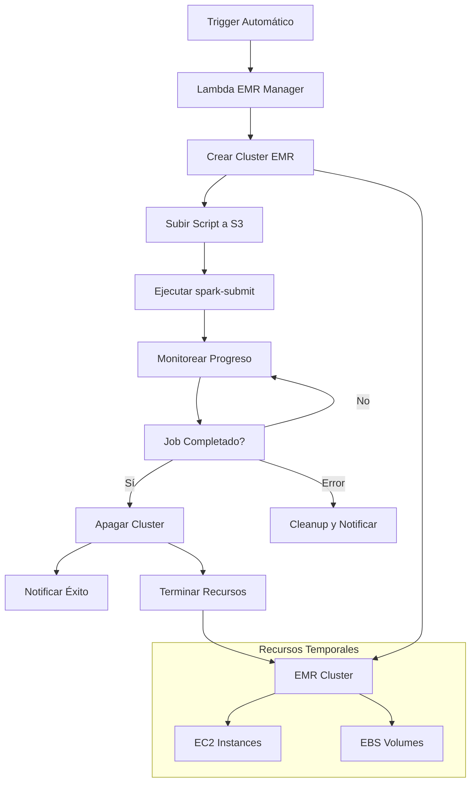

# Punto g) Automatización EMR con Lambda

Convertir notebook de ML anterior en **script ejecutable** y crear lambda que lance cluster EMR, ejecute el script con `spark-submit` y apague el cluster automáticamente.

## 🚧 Estado: PENDIENTE

Este punto está pendiente de implementación como parte del parcial final.

## 📋 Especificaciones

### Características Requeridas

- **Script ejecutable** - Conversión de notebook a script de producción
- **Lambda EMR Manager** - Gestión automática de clusters
- **Spark-submit** - Ejecución del script ML
- **Auto-shutdown** - Apagado automático del cluster

### Tecnologías

- **AWS Lambda** - Gestión de ciclo de vida EMR
- **AWS EMR** - Cluster Spark temporal
- **Boto3** - SDK de AWS para Python
- **CloudWatch Events** - Triggers automáticos

## 🎯 Componentes

### 1. Script de Producción ML

- **`ml_production_script.py`** - Versión productiva del notebook
- **Argumentos configurables** - Paths S3, parámetros de modelo
- **Logging robusto** - Métricas y estados detallados
- **Manejo de errores** - Recuperación y cleanup automático

### 2. Lambda EMR Manager

- **`emr_launcher.py`** - Gestión de clusters EMR
- **Configuración dinámica** - Tamaño cluster según volumen datos
- **Monitoreo de estado** - Seguimiento de progreso del job
- **Cleanup automático** - Terminación de recursos

## 🔄 Flujo de Trabajo



## 📊 Ventajas de la Automatización

### Costo-Eficiencia

- ✅ **Clusters temporales** - Solo pagar durante ejecución
- ✅ **Auto-scaling** - Recursos ajustados al workload
- ✅ **Terminación automática** - Sin recursos huérfanos

### Confiabilidad

- ✅ **Recuperación de errores** - Reintentos automáticos
- ✅ **Monitoreo proactivo** - Alertas de fallos
- ✅ **Cleanup garantizado** - Liberación de recursos

### Escalabilidad

- ✅ **Configuración dinámica** - Clusters según necesidad
- ✅ **Paralelización** - Múltiples jobs simultáneos
- ✅ **Programación flexible** - Triggers personalizados

## 🏗️ Arquitectura Propuesta

### Lambda Function

```python
# emr_launcher.py estructura
def lambda_handler(event, context):
    # 1. Validar parámetros de entrada
    # 2. Crear configuración cluster EMR
    # 3. Lanzar cluster con script ML
    # 4. Configurar monitoreo automático
    # 5. Programar terminación automática
```

### Configuración EMR

```yaml
ClusterConfig:
  InstanceGroups:
    - InstanceRole: MASTER
      InstanceType: m5.xlarge
      InstanceCount: 1
    - InstanceRole: CORE
      InstanceType: m5.large
      InstanceCount: 2-10 # Auto-scaling
  Applications:
    - Name: Spark
    - Name: Hadoop
  Steps:
    - Name: ML Pipeline Execution
      ActionOnFailure: TERMINATE_CLUSTER
      HadoopJarStep:
        Jar: command-runner.jar
        Args: ["spark-submit", "s3://bucket/scripts/ml_production_script.py"]
```

## 🔧 Implementación Planeada

### Archivos a Crear

1. **`emr_launcher.py`** - Lambda principal
2. **`ml_production_script.py`** - Script ML convertido
3. **`emr_config.json`** - Configuraciones de cluster
4. **`monitoring.py`** - Funciones de monitoreo
5. **`cleanup.py`** - Funciones de limpieza

### Parámetros Configurables

- **Cluster Size**: Número de instancias core
- **Instance Types**: Tipos de EC2 según workload
- **Timeout**: Tiempo máximo de ejecución
- **S3 Paths**: Ubicaciones de datos y resultados
- **Notification**: SNS topics para alertas

## 📈 Triggers de Activación

### Automáticos

- **Cron Schedule** - Ejecución diaria/semanal
- **S3 Events** - Nuevos datos disponibles
- **Glue Job Completion** - Después del pipeline ETL

### Manuales

- **API Gateway** - Ejecución bajo demanda
- **AWS Console** - Testing y desarrollo
- **CLI/SDK** - Integración con otros sistemas

## 🎯 Plan de Implementación

### Fase 1: Conversión de Notebook

- [ ] Convertir notebook a script ejecutable
- [ ] Parametrizar configuraciones
- [ ] Agregar logging y error handling

### Fase 2: Lambda EMR Manager

- [ ] Implementar lambda de gestión
- [ ] Configurar permisos IAM
- [ ] Testing con clusters pequeños

### Fase 3: Monitoreo y Alertas

- [ ] CloudWatch métricas custom
- [ ] SNS notificaciones
- [ ] Dashboard de monitoreo

### Fase 4: Optimización

- [ ] Auto-scaling inteligente
- [ ] Optimización de costos
- [ ] Performance tuning

## 🔗 Referencias

- [AWS EMR Best Practices](https://docs.aws.amazon.com/emr/latest/ManagementGuide/emr-plan.html)
- [Lambda EMR Integration](https://docs.aws.amazon.com/emr/latest/APIReference/Welcome.html)
- [Spark Submit Guide](https://spark.apache.org/docs/latest/submitting-applications.html)
